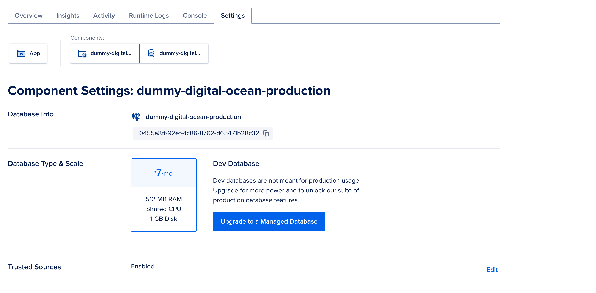

# Description of this project
This project is a simple Rails app that is going to be deployed in DigitalOcean's App Platform. The app is a simple blog with posts and comments.

`main` is going to be always the default branch to test this project, we're going to have another branch called `production` to deploy the app.

# Steps to create this project
1. Fork this project.
2. Create a new branch called `production`.
3. We need the env files for the RAILS_MASTER_KEY, SECRET_KEY_BASE, RAILS_ENV and RACK_ENV
    1. To get the RAILS_MASTER_KEY, you can extract it from config/master.key file.
    2. To get the SECRET_KEY_BASE, we need to run the following command in the terminal:
        ```bash
        EDITOR="code --wait" bin/rails credentials:edit
        ```
        This will open a new file in the code editor. We need to copy the SECRET_KEY_BASE and paste it in the env file.
   3. The RAILS_ENV and RACK_ENV should be set to production.
4. Create a .env file with this data, we're going to use it when setting the app.
5. This app starts without a database. We will attach it later to use the development database provided by DigitalOcean's App Platform. Otherwise, the deployment will fail because the development database is deployed after the Rails app, causing a deadlock since the Rails app requires a database to deploy.

# Steps to deploy in App Platform (DigitalOcean)

1. Create a new app in DigitalOcean's App Platform with GitHub as source provider.


2. Connect your GitHub account and select the repository, and the `production` branch. Click on the Autodeploy checkbox and then next.


3. We're going to keep things simple and cheap as possible.
   1. First of all, we're going to use the default Dockerfile in our app as our Build Strategy. So, if you see and extra instance with a Rails build pack, we're going to remove that.
      
   2. We're going to use the smallest instance size, which is Basic - $5/month.
      
   3. Now, time to set the env variables, click on `Edit` and then `Add from .env`, copy and paster your variables from your .env file.
      
   4. Select the closest region to you.
   5. Choose a name for your app, select the DigitalOcean project and click on `Create app`.
      
4. Once the deployment is finished, you can access your app by clicking on the link provided by DigitalOcean.


5. Let's add the database now. Go to the `Create` tab and click on `Create/Attach Database`.


6. We're going to use the smallest instance size, which is Basic - $7/month. The name of the database is going to be `dummy-digital-ocean-production`. Click on `Create Database`.


7. Once the database is created, you can get the credentials by clicking on setting and then on the database, scroll down.



